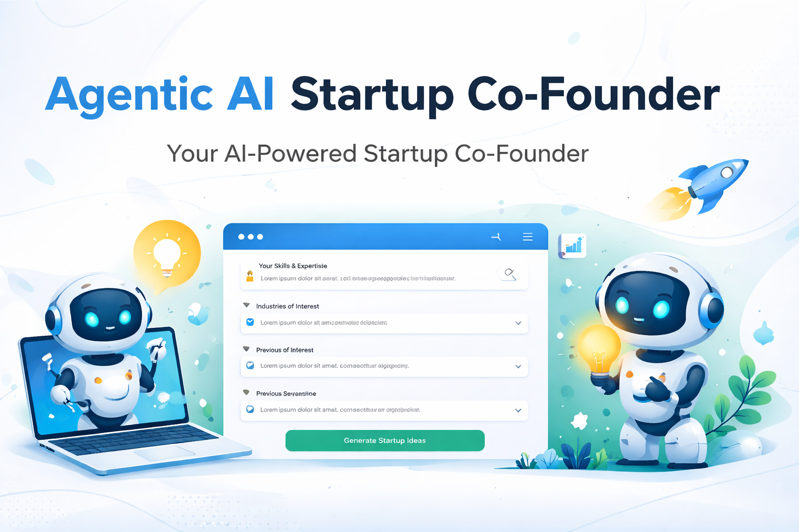

@"
# 🚀 AI Startup Co-founder

  

  
  
  
  

## 📖 Overview

**AI Startup Co-founder** is an intelligent platform that acts as your virtual business partner, helping entrepreneurs from idea to launch. It combines 13 specialized AI agents to provide deep strategic analysis, industry intelligence, and actionable insights.

## ✨ Key Features

### 🤖 13 Specialized AI Agents

| Agent | Function |
|-------|----------|
| **Idea Generator** | VC-grade startup opportunity analysis with 8-layer strategic framework |
| **Market Research** | Competitor analysis, trend identification, and market sizing |
| **Business Plan** | Comprehensive business plan generation with lean canvas |
| **Financial Model** | Revenue projections, unit economics, and break-even analysis |
| **Legal Documents** | Contracts, NDAs, and compliance templates |
| **Pitch Deck** | Investor-ready presentations with storytelling framework |
| **Product Development** | MVP roadmap, tech stack planning, and feature prioritization |
| **Marketing Strategy** | Go-to-market plans, channel selection, and growth strategies |
| **Funding Strategy** | Investor matching, fundraising roadmap, and term sheet analysis |
| **Team & Hiring** | Organization structure, role definitions, and hiring plans |
| **Startup Roadmap** | Milestone tracking, progress monitoring, and timeline management |
| **Operations** | Infrastructure planning, process optimization, and KPIs |
| **AI Co-founder** | Conversational business partner for real-time guidance |

## 🛠️ Tech Stack

### Frontend
- **Framework**: Next.js 14 (App Router)
- **Styling**: Tailwind CSS + shadcn/ui
- **Language**: TypeScript

### Backend
- **Framework**: FastAPI (Python)
- **AI Models**: Groq (Llama 3.3 70B)

## 📋 Prerequisites

- Node.js 18+
- Python 3.13+
- Groq API Key (Get from [console.groq.com](https://console.groq.com))

## 🚦 Getting Started

### 1. Clone the Repository
\`\`\`bash
git clone https://github.com/YOUR_USERNAME/ai-startup-cofounder.git
cd ai-startup-cofounder
\`\`\`

### 2. Install Frontend Dependencies
\`\`\`bash
npm install
\`\`\`

### 3. Install Backend Dependencies
\`\`\`bash
cd backend
pip install -r requirements.txt
cd ..
\`\`\`

### 4. Configure Environment Variables

**Frontend:**
\`\`\`bash
cp .env.example .env.local
\`\`\`

**Backend:**
\`\`\`bash
cd backend
cp .env.example .env
# Add your Groq API key to .env
\`\`\`

### 5. Start Backend
\`\`\`bash
cd backend
uvicorn main:app --reload
\`\`\`

### 6. Start Frontend
\`\`\`bash
npm run dev
\`\`\`

### 7. Open your browser
\`\`\`
http://localhost:3000
\`\`\`

## 📁 Project Structure

\`\`\`
Project_Test-1/
├── app/                    # Next.js pages
├── components/             # React components
├── backend/                # FastAPI backend
│   ├── agents/            # 13 AI agents
│   ├── main.py
│   └── requirements.txt
├── README.md
└── package.json
\`\`\`

## 🤝 Contributing

Contributions are welcome! Please feel free to submit a Pull Request.

## 📄 License

MIT License

## 🙏 Acknowledgments

- Built with [Groq](https://groq.com/)
- UI components from [shadcn/ui](https://ui.shadcn.com/)
- Icons from [Lucide](https://lucide.dev/)

---

  Made with ❤️ for entrepreneurs building the future

"@ | Out-File -FilePath README.md -Encoding UTF8